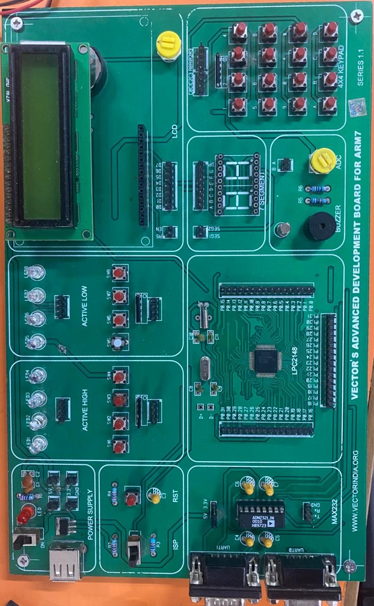

# 🔒 SecureLocker — Bluetooth-Based Secure Locker with Access Logging


-orange)


A complete, bare-metal **two-factor electronic locker** built around an
**NXP/Philips LPC2148** microcontroller (ARM7TDMI-S, 60 MHz). A phone sends the
first password over **Bluetooth (HC-05)**; a physical **4×4 matrix keypad**
takes the second; when both are correct a **DC motor (L293D)** opens the lock —
and every event is written to an **audit log with a real-time-clock timestamp**
readable on any PC serial terminal.

This is a college/final-year engineering project, written so a beginner can
read it top to bottom: **every register the chip configures is explained at
register level** in `docs/registers/`, every module is documented in
`docs/firmware/`, and the hardware is fully documented including a
**pin-level circuit diagram**.

---

## 📑 Table of contents

1. [What this repo is](#-what-this-repo-is)
2. [Features](#-features)
3. [How it works — the two-factor flow](#-how-it-works--the-two-factor-flow)
4. [Security features](#-security-features)
5. [The board](#-the-board)
6. [Hardware required](#-hardware-required)
7. [Project structure](#-project-structure)
8. [Quick start](#-quick-start)
9. [Documentation map](#-documentation-map)
10. [Making the clock survive power-off](#-the-one-hardware-secret-making-the-clock-survive-power-off)
11. [Testing & continuous integration](#-testing--continuous-integration)
12. [Technology notes](#-technology-notes)
13. [Project status & honest caveats](#-project-status--honest-caveats)
14. [Contributing](#-contributing)
15. [Security](#-security)
16. [License](#-license)

---

## ✨ What this repo is

- **Full bare-metal firmware** in strict C89 — no operating system, no
  libraries. You read and configure the LPC2148's own registers directly.
- **Industry-grade packaging**: this README, a fork-and-contribute guide, a
  changelog, a security policy, a license, and **continuous integration** that
  compile-checks every source file on every push.
- **Register-level documentation**: `docs/registers/` explains *exactly* what
  every PLL, timer, UART, I2C and RTC register is set to and why.
- **A working Keil µVision project** (`firmware/majorproject12.uvproj`) — open
  it, press Build, flash it. Nothing to set up.

> **Try it in seconds (no Keil needed):**
> ```bash
> cd firmware
> for f in *.c; do arm-none-eabi-gcc -c -O1 -Wall -Wextra -std=c89 \
>     -I. -Ivendor -D__irq= "$f" -o /tmp/"${f%.c}.o" || exit 1; done
> ```
> If that loop finishes without warnings, every source file is syntactically
> and type-correct. See [docs/testing/compile-verification.md](docs/testing/compile-verification.md).

---

## 🚀 Features

**The lock**

- **Two-factor authentication** — Bluetooth password *and* keypad password.
  One factor alone opens nothing.
- **DC-motor latch** (L293D H-bridge) — forward to open, hold 5 s, reverse to
  close, with a re-entrancy guard so only one cycle runs at a time.
- **30-second live clock** after a successful unlock — the idle LCD shows the
  current time, then returns to the password prompt.

**The security posture**

- **Boot self-test (POST)** — checks the EEPROM and the Bluetooth link are
  actually wired at power-on; shows wiring help on the LCD if they are not.
- **Password-bypass defence** — `1234#123456789` is **rejected**: the receiver
  flags trailing junk after `#`, and the comparison itself always examines
  every character (constant-time, no early exit).
- **Dual Level-2 timers** — a 3-minute hard ceiling *and* a 1-minute
  per-character idle limit, both with a **live seconds countdown** on the LCD.
- **Lockout** — 3 wrong attempts → 30-second lockout with a live countdown,
  and the Bluetooth buffer is discarded *before and after* so a queued
  password can't act the instant it ends.
- **Tamper detection** — the tamper switch is polled during *every* phase,
  including password entry and the lockout (the worst time to stop watching).

**The audit trail**

- **Timestamped audit log** over UART0 at 9600 baud — every open, every failed
  attempt, every timeout, every tamper event, and **every admin-menu change**
  (clock / alarm / password) is logged with the exact time.
- **Battery-backed real-time clock** — time survives power-off via an external
  DS1307/DS3231 RTC (see [§10](#-the-one-hardware-secret-making-the-clock-survive-power-off)).

**The engineering**

- **Strict C89**, zero-warning build, compile-verified in CI on every push.
- **Register-level documentation** — no black boxes, every value explained.
- **Layered POST** — the Bluetooth self-test returns a 4-state result, so a
  healthy module in data mode is no longer falsely accused at boot.

---

## 🚪 How it works — the two-factor flow

```
┌──────────┐  Bluetooth (HC-05)   ┌─────────────────────────────────────────┐
│  Phone   │ ───── "1234#" ─────▶ │                                         │
│  app     │                      │     LPC2148  (the "brain")              │
└──────────┘                      │                                         │
                                  │  LEVEL 1:  check the Bluetooth password  │
┌──────────┐ 4×4 matrix keypad    │    ─ only '#' terminates the command    │
│  User    │ ───── "5678" ──────▶ │                                         │
└──────────┘                      │  LEVEL 2:  check the keypad password    │
                                  │    ─ 3 min total, 1 min per character   │
                                  │            ─ live seconds countdown     │
                                  │                                         │
                                  │  BOTH OK ──▶ open_locker_sequence():    │
                                  │    DC motor (L293D) opens the lock,     │
                                  │    holds 5 s, reverses closed           │
                                  └──────────────┬──────────────────────────┘
                                                 │ every event, timestamped
                                                 ▼
                                  ┌──────────────────────────────┐
                                  │ UART0 @ 9600  →  PC serial    │
                                  │ audit log, e.g.:             │
                                  │ [01/01/2024 12:08:43] Level-1 │
                                  │   Bluetooth password matched  │
                                  └──────────────────────────────┘
```

### Step by step

1. **The system boots.** The LCD shows `Bluetooth / Secure System` and the boot
   self-test runs: the **I2C EEPROM** must pass a read/write probe, and the
   **UART1 link** must pass an internal loopback test. If a module is missing,
   the LCD parks on a fault screen and retries every 2 seconds — and the tamper
   switch stays monitored even while parked.
2. **Level-1 — Bluetooth.** You send `1234#` from a phone app. Only `#`
   terminates the command; CR/LF trailing bytes and anything after `#` are
   classified, not ignored. On a match the LCD shows `LEVEL1 OK / ENTER L2`.
3. **Level-2 — keypad.** Type the 4-digit keypad password on the physical
   keypad (masked as `****` on the LCD). A 3-minute total timer and a 1-minute
   per-character timer run live; `*` backspaces and `#` clears.
4. **Both match → open.** The motor pulses open, holds 5 seconds, reverses
   closed. The idle screen then shows the live clock for 30 seconds.
5. **Everything is logged.** Every attempt, success, timeout, tamper event and
   admin change goes out UART0 to a PC serial terminal with a timestamp.

> Defaults: Bluetooth password **`1234`**, keypad password **`5678`**. Both can
> be changed from the admin menu (press the admin button → password option).

Full details: [docs/firmware/authentication.md](docs/firmware/authentication.md)
and [docs/firmware/main-flow.md](docs/firmware/main-flow.md).

---

## 🛡️ Security features

| Feature | What it does |
|---|---|
| Two-factor entry | Phone password **and** keypad password — one alone opens nothing |
| Boot self-test (POST) | Checks the EEPROM and Bluetooth link are actually wired at power-on; shows wiring help on the LCD if not |
| Password bypass defence | `1234#123456789` is **rejected** — every bit of every character is compared, extra characters after `#` fail the attempt |
| Constant-time password compare | `password_match()` always examines all 4 characters — timing can't leak *how much* of a guess was right |
| Level-2 timeout + countdown | 3-minute total / 1-minute per-character limits with live seconds on the LCD |
| Lockout | 3 wrong attempts → 30-second lockout with live countdown; BT buffer flushed before and after |
| Tamper detection | Tamper switch watched during *every* phase, including password entry |
| Audited admin menu | Every clock/alarm/password change is logged with a timestamp |
| Battery-backed clock | Time **survives power-off** via an external DS1307/DS3231 RTC (see below) |
| EEPROM fault handling | If the I2C bus dies at runtime, a hardware fault screen appears instead of silently denying — and it doesn't count toward the lockout |

See [SECURITY.md](SECURITY.md) for the full model and its honest limits.

---

## 🖼️ The board

<p align="center">
  
</p>

The project runs on a hand-wired **vector board** with an **LPC2148** at its
centre. Every connection is documented in
[docs/hardware/connections.md](docs/hardware/connections.md), which includes a
**pin-level circuit diagram** (net list + design-rule check) of the exact
wiring shown above — and a full shopping list is in
[docs/hardware/bill-of-materials.md](docs/hardware/bill-of-materials.md).

---

## 🧱 Hardware required

| Part | Purpose |
|---|---|
| **LPC2148** MCU | The microcontroller (ARM7TDMI-S, 60 MHz) |
| **HC-05** Bluetooth module | Receives the Level-1 password over UART1 |
| **4×4 matrix keypad** | Takes the Level-2 password |
| **16×2 LCD** | Shows prompts, countdowns and the live clock |
| **AT24C256** I2C EEPROM | Stores both passwords (`LKR1` magic + L1@0x0010, L2@0x0020) |
| **DS1307 / DS3231** (optional) | Battery-backed real-time clock so the time survives power-off |
| **L293D** + **DC motor** | Opens the locker |
| Buzzer, tamper switch, admin button, MAX232 + DB9 | Alerts, intrusion detection, admin menu, PC serial log |

- Full part list with values: [docs/hardware/bill-of-materials.md](docs/hardware/bill-of-materials.md)
- Complete wiring (pin by pin): [docs/hardware/connections.md](docs/hardware/connections.md)

---

## 📁 Project structure

```
secure-locker/
├── firmware/                 ← the entire project source (flat on purpose, so
│   │                            the Keil .uvproj relative paths keep working)
│   ├── *.c / *.h             ← 12 modules + 14 headers
│   ├── Startup.s             ← ARM7 reset/startup vector table
│   ├── majorproject12.uvproj ← the real Keil project (Target 1)
│   ├── majorproject12.sct    ← scatter file (memory layout)
│   ├── majorproject12.hex    ← last prebuilt firmware image
│   ├── vendor/LPC214x.h      ← NXP device header (vendored → builds anywhere)
│   └── examples/1.TXT        ← a real captured audit-log session
├── docs/
│   ├── README.md             ← documentation index
│   ├── getting-started.md    ← beginner guide (what an MCU is, how this works)
│   ├── architecture.md       ← module map, boot sequence, main-loop state machine
│   ├── flowchart.md          ← ★ the whole system DRAWN as visual flowcharts
│   ├── future-advancements.md← roadmap: bigger MCUs, biometrics, IoT (face, fingerprint)
│   ├── registers/            ← ★ REGISTER-LEVEL reference (the big one)
│   ├── firmware/             ← per-module flow docs (auth, BT, menu, log…)
│   ├── hardware/             ← connections, schematic, BOM, component working
│   └── testing/              ← compile-verification + bench-test procedure
├── images/vector_board.jpeg  ← photo of the built board
├── .github/workflows/build.yml ← CI: compile-check every source on every push
├── SUBMISSION_NOTES.md        ← the ready-to-print submission/abstract document
├── LICENSE                   ← MIT
├── CHANGELOG.md              ← what changed in each round
├── CONTRIBUTING.md           ← fork guide, PR workflow, code style
└── SECURITY.md               ← security model + known limits
```

> **Why `firmware/` is flat:** the Keil project references every source with a
> relative `.\file.c` path. Keeping the sources exactly as-is means the
> `majorproject12.uvproj` builds unmodified. The module structure is explained
> in [docs/architecture.md](docs/architecture.md) instead of via folders.

---

## 🚀 Quick start

### 1. Get the code
```bash
git clone https://github.com/sap1119/BTSecureLocker.git
cd BTSecureLocker
```

### 2. Build with Keil µVision (recommended)
1. Install [Keil µVision](https://www.keil.com/download/product/) with the ARM device pack.
2. Open **`firmware/majorproject12.uvproj`**.
3. Press **Build (F7)** → you get `majorproject12.hex`.
4. Flash with a USB-to-serial adapter + **Flash Magic** (LPC2148 ISP mode,
   9600 baud, crystal 12 MHz).

### 3. Or compile-check without Keil (any machine)
An ARM GNU toolchain does a full syntax/type/link check of all 12 modules —
this is exactly what the CI workflow runs on every push:
```bash
cd firmware
for f in *.c; do arm-none-eabi-gcc -c -O1 -Wall -Wextra -std=c89 \
    -I. -Ivendor -D__irq= "$f" -o /tmp/"${f%.c}.o" || exit 1; done
```

### 4. First power-on
The LCD shows a **boot self-test**: `I2C EEPROM OK` and the Bluetooth link
result. Then the locker waits for `1234#` from your phone, then `5678` on the
keypad. The motor opens, holds, closes — and the whole session is on the
serial log. Full procedure: [docs/testing/bench-test-procedure.md](docs/testing/bench-test-procedure.md).

> **Defaults:** Bluetooth password `1234`, keypad password `5678`. Both can be
> changed from the admin menu (press the admin button → password option).

---

## 📚 Documentation map

Start with these, in this order:

1. **[docs/getting-started.md](docs/getting-started.md)** — "I've never seen an
   embedded project" — what the hardware is, how the flow works, and a guided
   tour of the code.
2. **[docs/architecture.md](docs/architecture.md)** — the module map, the exact
   boot sequence, and the main-loop state machine.
3. **[docs/flowchart.md](docs/flowchart.md)** — the *picture* version: the whole
   system drawn as detailed visual flowcharts (boot, POST, main loop,
   two-factor auth, motor, lockout, tamper, admin).
4. **[docs/registers/README.md](docs/registers/README.md)** — the register-level
   reference: clocking, GPIO, UART, I2C, timers, RTC, interrupts, memory map.
   Every register value the firmware writes, with the reason.
5. **[docs/firmware/README.md](docs/firmware/README.md)** — how each behaviour
   works: the authentication flow, the Bluetooth receiver, the admin menu, the
   audit log.
6. **[docs/hardware/connections.md](docs/hardware/connections.md)** — full
   wiring, including a pin-level circuit diagram.
7. **[docs/hardware/component-working.md](docs/hardware/component-working.md)** —
   how each component works on the inside, and what the firmware does to drive
   it.
8. **[docs/testing/bench-test-procedure.md](docs/testing/bench-test-procedure.md)** —
   the first power-on sequence.

Looking ahead? **[docs/future-advancements.md](docs/future-advancements.md)** is
the roadmap: moving to an ESP8266/ESP32/Arduino controller, plus future security
layers — face unlock, fingerprint, one-time passwords, IoT logging, and physical
hardening.

There is also a real captured serial-log session to read alongside the docs:
[`firmware/examples/1.TXT`](firmware/examples/1.TXT).

---

## 🔌 The one hardware secret: making the clock survive power-off

The LPC2148's on-chip RTC is clocked from the CPU clock and has **no
battery-backup pin and no crystal pins** — so on its own it cannot tick while
the board is unpowered. This project fixes that with an **external
battery-backed RTC chip** (DS1307 or DS3231) on the I2C bus:

- At boot the firmware **probes** for it (`RTC_EXT_ENABLED`, default on).
- If a chip answers with a plausible time, that time is loaded into the on-chip
  RTC and kept in step on every clock write — **the time survives power-off.**
- If no chip is fitted, the firmware no longer destroys the RTC at boot, and
  the log says honestly what state the clock is in.

Wiring + firmware switch: [docs/registers/rtc.md](docs/registers/rtc.md) and
[docs/hardware/connections.md](docs/hardware/connections.md).

---

## 🧪 Testing & continuous integration

Every push and pull request runs
[`.github/workflows/build.yml`](.github/workflows/build.yml), which:

1. **Compiles every one of the 12 translation units** with
   `arm-none-eabi-gcc -c -O1 -Wall -Wextra -std=c89 -I. -Ivendor -D__irq=`
   — the vendored `firmware/vendor/LPC214x.h` makes this work **with no Keil
   installed**.
2. **Fails on any warning** from project code.
3. **Runs a relocatable link + symbol check** — only `strcmp` and
   `__aeabi_uidiv` (libc / compiler runtime) may remain undefined.

So the repo is self-verifying: if CI is green, every file compiles cleanly and
everything links. How to reproduce it locally, and how to read the results:
[docs/testing/compile-verification.md](docs/testing/compile-verification.md).

---

## 🛠️ Technology notes

- **Toolchain:** Keil µVision (armcc) — the build you'll use. `arm-none-eabi-gcc`
  for CI/verification only.
- **Language:** strict C89 (`-std=c89 -Wall -Wextra`, zero warnings).
- **Chip:** LPC2148, ARM7TDMI-S, 60 MHz core / 15 MHz peripheral clock
  (PLL `0x24`, `VPBDIV=0`).
- **Buses:** UART0 (audit log), UART1 (Bluetooth), I2C0 (EEPROM + external RTC),
  GPIO for keypad/LCD/motor/buzzer.
- **Interrupts:** VIC IRQ channels 7 (UART1 RX) and 16 (EINT2 admin button).
- **Timing:** Timer0 = short delays; Timer1 = a free-running millisecond
  timebase that every timeout in the project measures against.

---

## 📊 Project status & honest caveats

- **Status:** complete and faculty-approved. The full history of every round of
  changes is in [CHANGELOG.md](CHANGELOG.md).
- **Honest caveats:**
  - **Tested on the physical hardware, with two exceptions.** The core system
    — boot self-test, Bluetooth + keypad two-factor entry, the motor open/close
    sequence, lockout, tamper, admin menu, alarm, the UART0 audit log and the
    on-chip RTC — has been bench-tested on the board shown in this README. The
    two things that have **not** been tested on hardware are the **external
    battery-backed RTC** (it needs the DS1307/DS3231 chip + coin cell
    physically fitted; the firmware auto-detects it) and everything in the
    [future-advancements](docs/future-advancements.md) roadmap (design only).
  - **Bluetooth is transmitted in the clear** and the LPC2148 has no crypto
    hardware — this is a physical-security teaching project, not a bank vault.
    See [SECURITY.md](SECURITY.md).
  - The external RTC requires you to **physically fit the chip** and wire the
    coin cell; the firmware auto-detects it, but the hardware must be there.

---

## 🤝 Contributing

Pull requests are welcome — from a typo in the docs to a new security feature.
Read **[CONTRIBUTING.md](CONTRIBUTING.md)** first: it has the fork guide, the
PR workflow, and the project's load-bearing rules (the ones you must not
break, like "no `printf`" and "all passwords go through `password_match()`").

## 🛡️ Security

See **[SECURITY.md](SECURITY.md)** for the security model, what the firmware
protects against, and its honest limitations (e.g. Bluetooth is transmitted in
the clear, and the LPC2148 has no crypto hardware).

## 📜 License

[MIT](LICENSE) © SecureLocker project contributors.

---

*Built for a college engineering project. Documented to industry standards so
it is worth more than a grade — it is a working reference for bare-metal
ARM development.*
